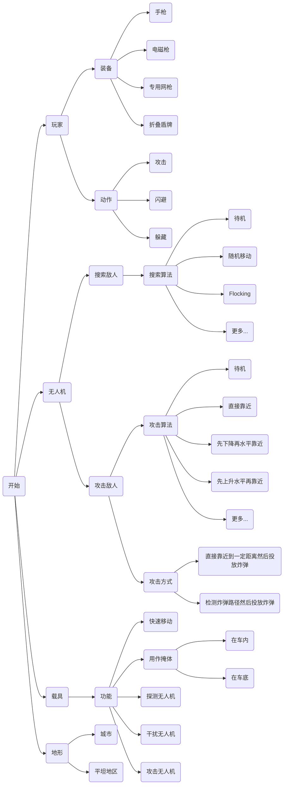

# AntiDroneSimulator

## 1. 整体架构

## 2. 无人机控制

### 2.1 追踪算法

1. 摄像机获取无人机视频流（RGB图像）
2. 通过http网络通信传递到服务器（基于Django和Pytorch实现）
3. 目标检测：使用YOLO算法，接受RGB图像，返回检测到的玩家信息
   * 如何训练：目前使用成熟的预训练参数（ultralytics库，yolov8n.pt）
4. 持续跟踪：使用DQN算法，接受无人机当前状态和检测到的玩家信息，以及当前地形信息，返回无人机移动方向
   * 环境建模：
     * 状态空间：无人机的速度和位置，检测到的行人位置（摄像机中的位置），地形信息（周围是否有障碍物，障碍物有多近）
     * 动作空间：无人机接下来一段时间的移动方向
   * 奖励函数设计：
     * 跟踪奖励：无人机接近行人时获得正奖励，远离行人时获得负奖励。
     * 避障奖励：无人机避开障碍物时获得正奖励，碰撞时获得负奖励。
   * 如何获取训练数据：
     * 无人机采用随机运动的方式，基于目标检测得到的结果和引擎中获取的各种信息，获取经验回放
5. 无人机根据得到的移动方向进行运动
