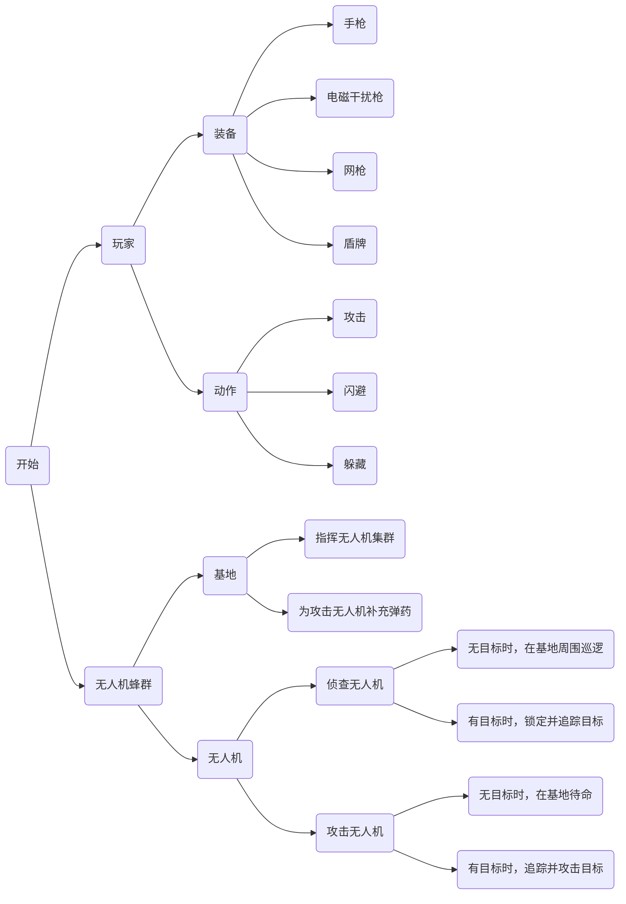
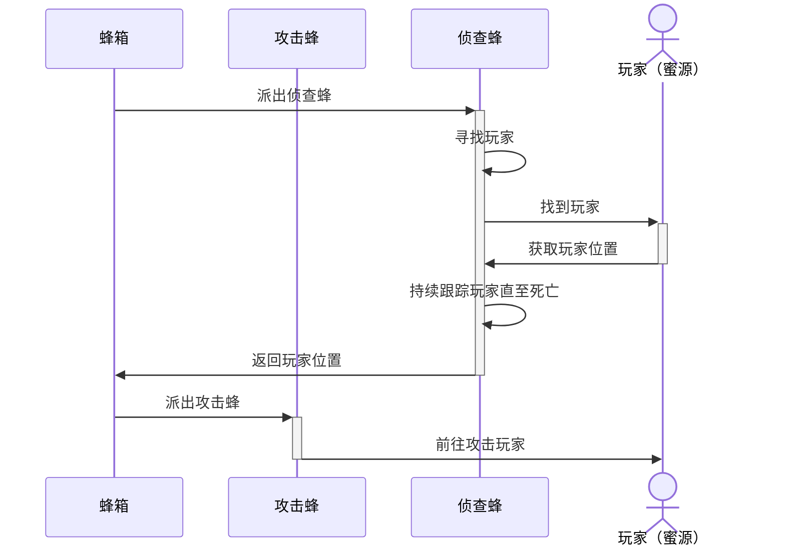

# AntiDroneSimulator

## 1. 整体架构

## 2. 玩家设计

### 2.1 玩家基础操作

- 移动
- 转动视角
- 跳跃
- 开火
- 装弹
- 翻滚
- 蹲下、起立
- 换枪
- 放置、捡起盾牌

### 2.2 枪支设计

* 手枪
  * 发射普通子弹，可摧毁无人机

* 便携式网枪
  * 发射网型子弹，可包住无人机使其失去行动能力

* 电磁脉冲枪
  * 发射干扰弹，可使无人机失灵5秒

## 3. 无人机设计

### 3.1 基础无人机

* 使用摄像头探测并锁定敌人
* 使用雷达检测周围障碍物并避障
* 根据命令进行移动

### 3.2 侦查无人机

* 速度较快
* 无目标时，在基地周围进行巡逻
* 有目标时，可锁定并追踪敌人

### 3.3 攻击无人机

* 速度较慢，但可携带炸弹攻击敌人
* 无目标时，在基地待机
* 有目标时，从基地携带炸弹，飞往敌人所在地并投掷炸弹，随后返回基地装填炸弹。

## 4. 技能设计

* 暂停游戏
  * [P]

* 观察者模式
  * [O]

## 5. 无人机蜂群

* 蜜源： 玩家位置。
* 侦查蜂：速度较快，不携带炸弹。
  * 无目标时，在蜂箱附近巡逻。
  * 有目标时，锁定并追踪目标。

* 攻击蜂：速度较慢，携带炸弹。
  * 无目标时，在基地待机。
  * 有目标时，从基地携带炸弹并攻击玩家。

* 蜂箱：蜜蜂基地
  * 指挥蜂群。
  * 侦查蜂在附近巡逻。
  * 攻击蜂在此携带炸弹。

## 6. 无人机控制（deprecated）

### 6.1 追踪算法

1. 摄像机获取无人机视频流（RGB图像）
2. 通过http网络通信传递到服务器（基于Django和Pytorch实现）
3. 目标检测：使用YOLO算法，接受RGB图像，返回检测到的玩家信息
   * 如何训练：目前使用成熟的预训练参数（ultralytics库，yolov8n.pt）
4. 持续跟踪：使用DQN算法，接受无人机当前状态和检测到的玩家信息，以及当前地形信息，返回无人机移动方向
   * 环境建模：
     * 状态空间：无人机的位置，检测到的行人位置（摄像机中的位置），地形信息（周围是否有障碍物，障碍物的相对位置）
     * 动作空间：无人机接下来一段时间的移动方向（14个方向）
   * 奖励函数设计：
     * 跟踪奖励：无人机接近行人时获得正奖励，远离行人时获得负奖励。
     * 避障奖励：无人机避开障碍物时获得正奖励，碰撞时获得负奖励。
   * 如何获取训练数据：
     * 无人机采用随机运动的方式，基于目标检测得到的结果和引擎中获取的各种信息，获取经验回放
5. 无人机根据得到的移动方向进行运动

> 注：此为一种基于AI的解决方案。首先进行利用深度学习进行目标检测，然后利用强化学习获取无人机下一步的动作。由于效果较差故使用其他的方案进行替代。

