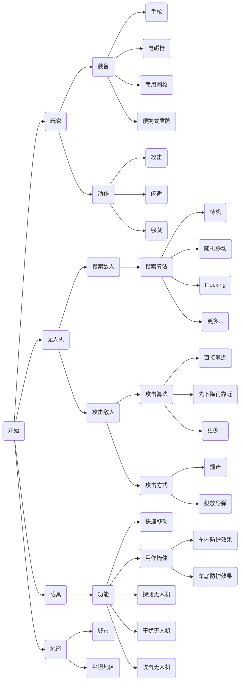

# AntiDroneSimulator

```mermaid
flowchart LR
	Start(开始)
	Start --> Player
	Start --> Drone
	Start --> Vehicle
	Start --> Terrain
	
	Player(玩家)
	Player --> Equipment
	Player --> Action
	
	Drone(无人机)
	Drone --> Serach
	Drone --> Attack
	
	Vehicle(载具)
	Vehicle --> Function

	Terrain(地形)
	Terrain --> City
	Terrain --> Flat

	Equipment(装备)
	GeneralGun(手枪)
	EMPGun(电磁枪)
	SkyWallGun(专用网枪)
	Shield(便携式盾牌)	
	Equipment --> GeneralGun
	Equipment --> EMPGun
	Equipment --> SkyWallGun
	Equipment --> Shield
	
	Action(动作)
	PlayerAttack(攻击)
	PlayerEvade(闪避)
	PlayerHide(躲藏)
	Action --> PlayerAttack
	Action --> PlayerEvade
	Action --> PlayerHide
	
	Serach(搜索敌人)
	Serach --> SerachAlg(搜索算法)
	SerachAlg --> Stay(待机)
	SerachAlg --> RandomMove(随机移动)
	SerachAlg --> Flocking(Flocking)
	SerachAlg --> More1(更多...)
	
	Attack(攻击敌人)
	Attack --> AttackAlg(攻击算法)
	Attack --> AttackMethod(攻击方式)
	AttackAlg --> forward(直接靠近)
	AttackAlg --> down(先下降再靠近)
	AttackAlg --> More(更多...)
	AttackMethod --> hit(撞击)
	AttackMethod --> bomb(投放导弹)
	
	Function(功能)
	ForMove(快速移动)
	ForHide(用作掩体)
	ForSerach(探测无人机)
	ForDisturb(干扰无人机)
	ForAttack(攻击无人机)
	Function --> ForMove
	Function --> ForHide
	Function --> ForSerach
	Function --> ForDisturb
	Function --> ForAttack
	ForHide --> InCar(车内防护效果)
	ForHide --> BehindCar(车底防护效果)
	
	City(城市)
	Flat(平坦地区)
		
```

